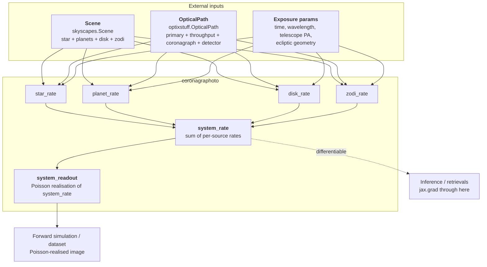
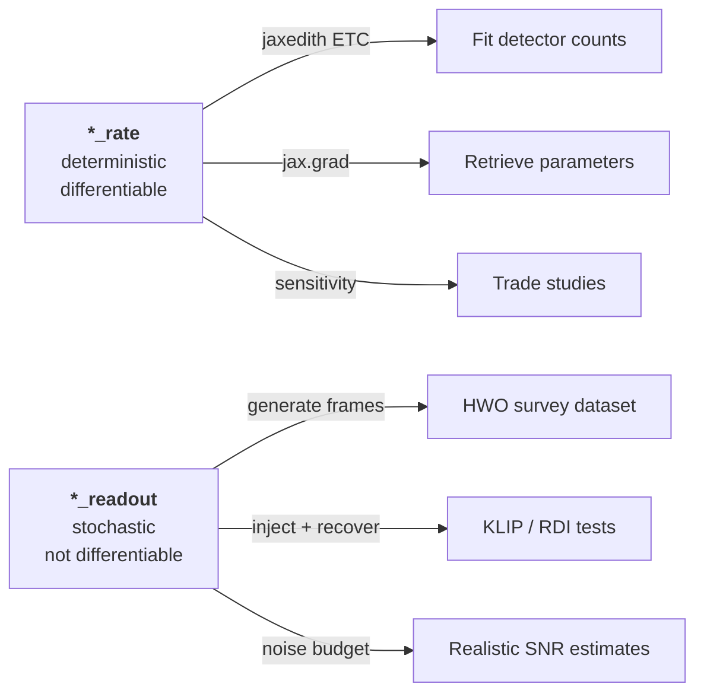

# Architecture

This page explains what coronagraphoto does, what it does NOT do, and
which sibling library owns each piece of the forward model. If you're
trying to figure out "where does X live?", start here.

## Scope of coronagraphoto

coronagraphoto is the **image generator** for the HWO simulation suite.
Given:

- A **scene** -- the astrophysical content (star, planets, disk, zodi)
- An **optical path** -- the telescope hardware (primary aperture,
  throughput stack, coronagraph backend, detector)
- An **exposure** -- when, how long, what wavelength

coronagraphoto returns a 2D detector image at the resolution of the
optical path's detector. Two flavours, both at the same detector grid:

- A deterministic count-rate map (`*_rate` family)
- A Poisson-realised electron count (`*_readout` family)

See [rate vs readout](rate_vs_readout) for the dichotomy in detail.

That's it. Everything else lives elsewhere.

## What coronagraphoto does NOT do

| Concern | Where it lives |
|---|---|
| Defining a star / planet / disk / zodi source | {mod}`skyscapes.scene`, {mod}`skyscapes.background` |
| Physical models (Lambertian, ExoJax, etc.) | {mod}`skyscapes.physical_model` |
| Loading ExoVista FITS files | {func}`skyscapes.from_exovista` |
| Defining a primary aperture, detector, throughput element | {mod}`optixstuff` |
| Detector noise sources (dark current, read noise, CIC) | {func}`optixstuff.dark_current`, {func}`optixstuff.read_noise`, {func}`optixstuff.clock_induced_charge` |
| Off-axis PSF synthesis from YIP files | {mod}`yippy` |
| PSF subtraction (KLIP, RDI), SNR maps | {mod}`coronalyze` |
| Orbital mechanics, observatory orbits, scheduling | [orbix](https://github.com/CoreySpohn/orbix) |
| Exposure-time / yield calculations | [jaxedith](https://github.com/CoreySpohn/jaxedith) |

If you find yourself reaching for "how do I build a Star?" or "how do
I pick a detector model?", you're looking at the wrong docs. Those
questions live in {mod}`skyscapes` and {mod}`optixstuff` respectively.

## The pipeline



The per-source `*_rate` and `*_readout` functions are the entry points
for users who only care about one component. `system_rate` and
`system_readout` are convenience orchestrators that sum the per-source
contributions across an entire `Scene`.

## Composition with sibling libraries

coronagraphoto consumes types from siblings; it does NOT re-export them
into a flat namespace. Build your `Scene` and `OpticalPath` using the
sibling libraries' constructors, then pass them in:

```python
# Scene-building lives in skyscapes
from skyscapes import from_exovista
scene = from_exovista("path/to/exovista_system.fits")

# Optical-path building lives in optixstuff
from optixstuff import (
    OpticalPath, SimplePrimary, ConstantThroughput, IdealDetector,
)
from yippy import EqxCoronagraph

optical_path = OpticalPath(
    primary=SimplePrimary(diameter_m=6.0),
    attenuating_elements=(ConstantThroughput(throughput=0.9),),
    coronagraph=EqxCoronagraph("path/to/yip"),
    detector=IdealDetector(pixel_scale_arcsec=0.01, shape=(512, 512)),
)

# coronagraphoto is what turns these into a 2D image
from coronagraphoto import system_rate, system_readout
rate_map = system_rate(scene, optical_path, ...)
import jax
image = system_readout(scene, optical_path, jax.random.PRNGKey(0), ...)
```

Hardware types (`OpticalPath`, `SimplePrimary`, `IdealDetector`,
`ConstantThroughput`, ...) are imported from `optixstuff`; scene types
(`Scene`, `Star`, `Planet`, ...) from `skyscapes`. coronagraphoto does
not re-export them. The one convenience entry point that lives here is
`load_scene_from_exovista` (in `coronagraphoto.loaders`), which wraps
`skyscapes.from_exovista` and attaches a default
`skyscapes.background.AYOZodi` for the common ExoVista case.

## Fitting vs data generation

**Fitting** workflows use the deterministic rate pipeline; **data
generation** workflows use the Poisson readout pipeline.



The same coronagraphoto pipeline backs both kinds of work. The only
difference is whether you call `system_rate(...)` or
`system_readout(...)` at the end.

## Where to read next

- [Rate vs readout](rate_vs_readout) -- when to reach for each family
- [Performance](performance) -- captured-constants hygiene, GPU
  benchmarks, and the closure-vs-args trap
