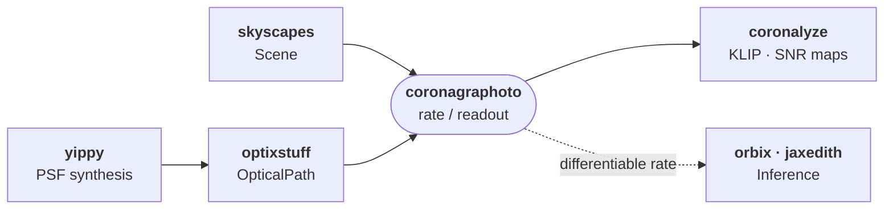

# coronagraphoto

JAX-native coronagraphic image simulation for HWO mission planning.

`coronagraphoto` consumes a {class}`skyscapes.Scene` (star + planets
+ disk + zodi) and an {class}`optixstuff.OpticalPath` (primary aperture
+ throughput stack + coronagraph backend + detector) and produces one
of two things:

- A **deterministic count-rate map** (`star_rate`, `planet_rate`,
  `disk_rate`, `zodi_rate`, `system_rate`) -- differentiable through
  the full forward model. Use for fitting, retrievals, sensitivity
  studies.
- A **Poisson-realised detector readout** (`star_readout`,
  `planet_readout`, `disk_readout`, `zodi_readout`, `system_readout`)
  -- the noisy 2D electron count you would actually observe. Use for
  forward simulation and dataset generation.

Both produce 2D images on the same detector grid; they differ only in
whether Poisson noise has been applied. See
[rate vs readout](explanation/rate_vs_readout) for when to reach for
each.

## Where coronagraphoto sits in the stack



`coronagraphoto` is the **image generator**. Inference,
post-processing, and analysis live in sibling libraries.

| Task | Library |
|---|---|
| Build a `Scene` (star, planets, disk, zodi, physical models) | [skyscapes](https://skyscapes.readthedocs.io/) |
| Build an `OpticalPath` (primary, detectors, coronagraph backend) | [optixstuff](https://optixstuff.readthedocs.io/) |
| Off-axis PSF synthesis from YIP files | [yippy](https://yippy.readthedocs.io/) |
| KLIP / RDI / ADI subtraction, Mawet SNR maps | [coronalyze](https://coronalyze.readthedocs.io/) |
| Orbital mechanics, observatory orbits, EIG scheduling | [orbix](https://github.com/CoreySpohn/orbix) |
| Exposure-time and yield calculations | [jaxedith](https://github.com/CoreySpohn/jaxedith) |

## A 30-line example

```python
import jax
from coronagraphoto import system_readout
from optixstuff import (
    OpticalPath, SimplePrimary, IdealDetector, ConstantThroughput,
)
from skyscapes import from_exovista
from yippy import EqxCoronagraph

scene = from_exovista("path/to/exovista_system.fits")
optical_path = OpticalPath(
    primary=SimplePrimary(diameter_m=6.0),
    attenuating_elements=(ConstantThroughput(throughput=0.9),),
    coronagraph=EqxCoronagraph("path/to/coronagraph_data"),
    detector=IdealDetector(pixel_scale_arcsec=0.01, shape=(512, 512)),
)
image = system_readout(
    scene, optical_path, jax.random.PRNGKey(0),
    start_time_jd=2_460_000.0,
    exposure_time_s=3600.0,
    wavelength_nm=550.0, bin_width_nm=50.0,
    telescope_pa_deg=0.0,
    ecliptic_lat_deg=0.0, solar_lon_deg=135.0,
)
```

```{toctree}
:maxdepth: 1
:caption: Get started
:hidden:

installation
```

<!-- TODO(post-1.0): write tutorials/01_first_simulation and re-add to toctree. -->


```{toctree}
:maxdepth: 1
:caption: Explanation
:hidden:

explanation/rate_vs_readout
explanation/architecture
explanation/performance
```

```{toctree}
:maxdepth: 1
:caption: How-to
:hidden:

simulating_zodi_with_telescope_orbit
```

```{toctree}
:maxdepth: 2
:caption: API Reference
:hidden:

autoapi/coronagraphoto/index
```
